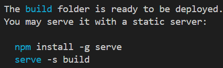

# React
1. 환경설정
    - npm / npx 차이점 
    > [npm vs npx](https://ljh86029926.gitbook.io/coding-apple-react/undefined/npm-npx)
    - 리액트 프로젝트 생성 도구
    > create-react-app
    - 메모리가 부족할 시 npx create-react-app가 실행이 안될 수 있다. 

2. 소스코드 수정방법
    - ReactDOM에서 createRoot 하여 const로 할당 -> render.
    - ``` const root = ReactDOM.createRoot(document.getElementById('root')); ```
    > [createRoot Reference](https://ko.react.dev/reference/react-dom/client/createRoot)
    - HTMLElement Document
    > [HTMLElement](https://developer.mozilla.org/en-US/docs/Web/API/HTMLElement)

3. 배포
    - ```npm run build```
    - ```npx serve -s build``` 
    > 